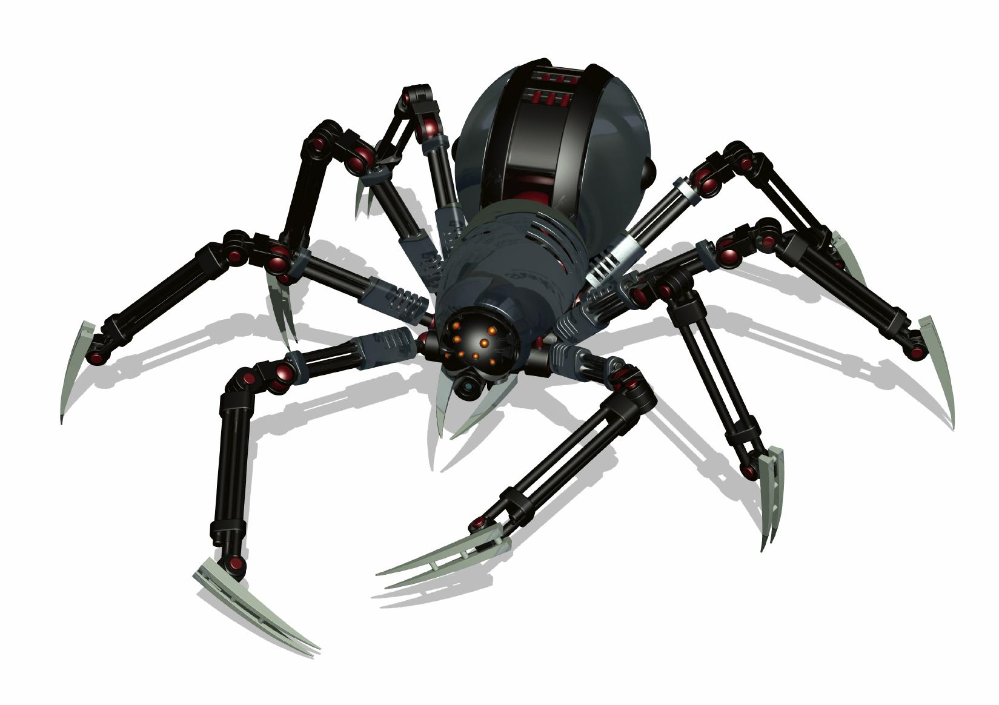

 
 


 
 


<p align="left">

</p>


Read this in other languages: [Russian](README.ru.md), [हिन्दी](README.hindi.md), [English](README.md)


<div align="center">


# 快速簡單的爬蟲
</div>

## 這個怎麼運作？
這很簡單：您的機器人大量訂閱您的帳戶作為回應，人們訂閱您。
# 準備和使用機器人的順序
. 克隆存儲庫或從 github 下載存檔或在命令行上使用以下命令
   ```commandline
   $ cmd
   $ git clone https://github.com/BEPb/github_bot
   $ cd github_bot
   ```
2. 創建 Python 虛擬環境。
3. 使用以下命令為我們的代碼安裝所有必要的包：

```commandline
        pip install -r requirements.txt
```


4.創建一個名為nameproject的項目
```commandline
scrapy startproject nameproject
```

5. 之後，您將擁有一個帶有該項目名稱的文件夾，其中包含最少的必要文件和依賴項
```commandline

    scrapy.cfg    # deploy 配置文件
    nameproject/  # 項目的 Python 模塊，你將從這裡導入你的代碼
        __init__.py
        items.py        # 項目項目定義文件
        middlewares.py  # 項目中間件文件
        pipelines.py    # 項目管道文件
        settings.py     # 項目設置文件
        spiders/        # 稍後放置蜘蛛的目錄
            __init__.py
```
6.進入我們的項目文件夾
```commandline
cd nameproject
```

7. 在 spiders/ 文件夾中創建一個quotes_spider.py 文件，並在其中寫下我們作弊的人和方式
8. 啟動我們的爬蟲
```commandline
scrapy crawl quotes
```
9. 作為執行的結果，創建了兩個新文件：quotes-1.html 和quotes-2.html，內容為
  對應的 URL，正如我們的 parse 方法所指定的。
10. 使用外殼選擇器
```commandline
scrapy shell 'https://quotes.toscrape.com/page/1/'
```
11.使用css查看所有'title'對象。執行 response.css('title') 的結果類似於
  名為 SelectorList 的列表對象，它是包裝的 Selector 對象的列表
  XML/HTML 元素，並允許您執行其他查詢以優化選擇或檢索數據。
```commandline
response.css('title')
```
12.為了查看列表，指定getall()方法
```commandline
response.css('title::text').getall()
```
13.同樣可以用xpath做
```命令行
response.xpath('//title/text()').get()
```
14. 現在使用帶有類引號的 div 標籤
```命令行
response.css("div.quote")
```

15. 只取列表中的第一個元素
```命令行
response.css("div.quote")[0]
```

16.為了獲取標籤中的類，使用以下命令：
```命令行
quote.css("span.text::text").get()
quote.css("small.author::text").get()
```
17. 這就是我們將如何顯示 div 標籤的類的完整列表
```命令行
response.css("div.quote").css("div.tags a.tag::text").getall()
```
18. 這就是我們將結果保存為 json 格式的方式，其中 `-O` 命令行開關會覆蓋任何現有的
  文件;
```commandline
scrapy crawl quotes -O quotes.json
```
19. 這就是我們將結果保存為 csv 格式的方式
```commandline
scrapy crawl quotes -O quotes.csv
```
20.以下命令使用.jl格式逐行寫入
```commandline
scrapy crawl quotes -o quotes.jl
```

