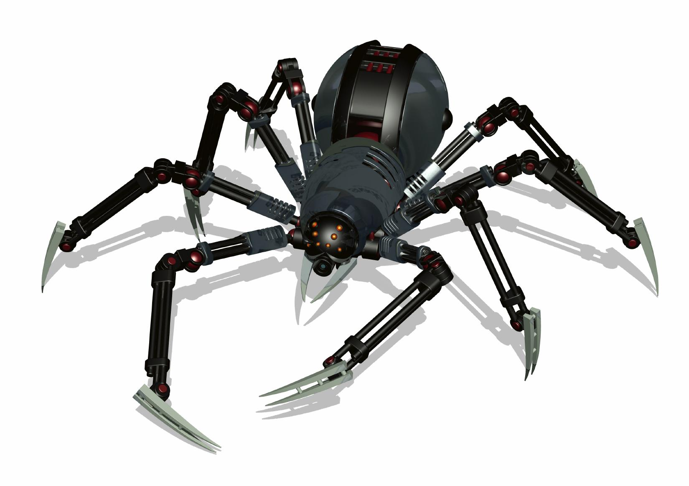

 
 


 
 


<p align="left">

</p>


Read this in other languages: [English](README.md), [हिन्दी](README.hindi.md), [中國人](README.chinese.md)


<div align="center">


## Быстрый и простой краулер

</div>

## Как это работает?

Все очень просто: твой бот массово подписывает твой аккаунт в ответ люди подписываются на тебя.

## Порядок подготовки и работы с ботом

1. Клонировать репозиторий либо скачать архив из github или при помощи следующих команд в командной строке
   ```commandline
   $ cmd
   $ git clone https://github.com/BEPb/github_bot
   $ cd github_bot
   ```

2. Создать виртуальное окружение Python.
3. Установить все необходимые пакеты для работы нашего кода, при помощи следующей команды:

    ```
    pip install -r requirements.txt
    ```


4. создаем проект с названием nameproject
```commandline
scrapy startproject nameproject
```

5. после чего у вас появится папка с названием этого проекта а в ней минимально необходимые файлы и зависимости
```commandline

    scrapy.cfg            #  deploy configuration file
    nameproject/             # project's Python module, you'll import your code from here
        __init__.py
        items.py          # project items definition file
        middlewares.py    # project middlewares file
        pipelines.py      # project pipelines file
        settings.py       # project settings file
        spiders/          # a directory where you'll later put your spiders
            __init__.py
```
6. переходим в папку нашего проекта
```commandline
cd nameproject
```

7. создаем файл quotes_spider.py в папке spiders/ и прописываем в нем кого и как кравлим
8. запускаем наш краулер
```commandline
scrapy crawl quotes
```
9. в результате выполнения были созданы два новых файла: quotes-1.html и quotes-2.html с содержимым для 
  соответствующих URL-адресов, как parseуказывает наш метод. 
10. используем селекторы оболочки 
```commandline
scrapy shell 'https://quotes.toscrape.com/page/1/'
```
11. просмотрим все объекты 'title' используя css. Результатом выполнения response.css('title')является похожий на 
  список объект с именем SelectorList, который представляет собой список Selectorобъектов, которые обертывают 
  элементы XML/HTML и позволяют выполнять дополнительные запросы для детализации выборки или извлечения данных.  
```commandline
response.css('title')
```
12. а для того что бы просмотреть список укзаываем метод getall()
```commandline
response.css('title::text').getall()
```
13. тоже самое можно и сделать и при помощи xpath
```commandline
response.xpath('//title/text()').get()
```
14. а теперь возьмем теги div с классом quote 
```commandline
response.css("div.quote")
```

15. возьмем только первый элемент в списке
```commandline
response.css("div.quote")[0]
```

16. для того что бы достать в теге класс используем следующую команду:
```commandline
quote.css("span.text::text").get()
quote.css("small.author::text").get()
```
17. а вот так мы выведем полный список класса тега div
```commandline
response.css("div.quote").css("div.tags a.tag::text").getall()
```
18. так мы сохраним результат в формат json, где Переключатель `-O` командной строки перезаписывает любой существующий 
  файл;
```commandline
scrapy crawl quotes -O quotes.json
```
19. а так мы сохраним результат в формат csv
```commandline
scrapy crawl quotes -O quotes.csv
```
20. следующая команда осуществляет запись по строчно за счет формата .jl
```commandline
scrapy crawl quotes -o quotes.jl
```
